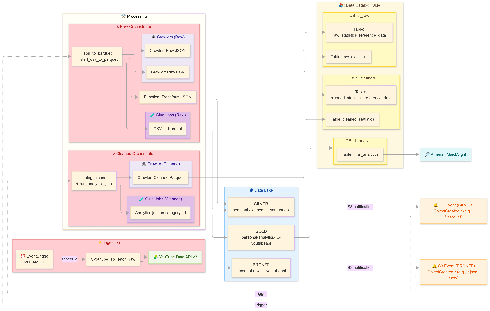

# YouTube ELT on AWS (Bronze → Silver → Gold)

Event-driven ELT pipeline that ingests YouTube Data API results into **S3 Bronze**, transforms to **Silver (Parquet)**, joins curated analytics to **Gold**, catalogs with **AWS Glue**, and analyzes with **Athena/QuickSight**.

## Architecture

> Source Mermaid is in `diagrams/architecture.mmd` (PNG shown here because native Mermaid can render box layouts inconsistently on GitHub).

---

## Background & choices (cost, credits, cloud parity)

I built this on **AWS**. I considered other services, but I wanted to stay on **budget** and I had **AWS credits**, so it made sense to ship here. Bonus: it gave me hands-on time in another cloud beyond my **GCP** experience. The main lesson—patterns are very similar across clouds; names change, not the ideas.

This project focuses on a clear, event-driven **data lake**. If budget allowed, I’d explore **Step Functions** for orchestration, **Amazon MWAA (Airflow)** for DAGs, and **SageMaker** for ML exploration. On the GCP side I only used the **YouTube Data API** client for ingestion.

---

## What’s in this repo

- `diagrams/architecture.png` — the image embedded above  
- `diagrams/architecture.mmd` — Mermaid source (optional reference)  
- `docs/RUNBOOK.md` — exact execution order (ingest → raw orchestration → cleaned orchestration → analytics)  
- `docs/BUCKETS.md` — Bronze/Silver/Gold paths and partitioning  
- `docs/DATA_CATALOG.md` — Glue DBs, tables, crawlers, and jobs  
- `docs/ANALYTICS.md` — Athena query examples + (optional) QuickSight notes  
- `src/` — Lambda & Glue job Python code
- `docs/results/` — final sample AWS Athena query and AWS QuickSight files
- `docs/screenshots/` — evidence from the AWS console (filenames referenced below)

---

## Execution flow (TL;DR)

1. **Ingestion (EventBridge → Lambda)** `youtube_api_fetch_raw` @ **5:00 AM CT**  
   Writes JSON metadata and CSV metrics to **Bronze**.
2. **Raw Orchestration (S3 → Lambda)** `raw_json_parquet_orchestrator`  
   Triggers crawlers; runs **CSV→Parquet** Glue job; flattens JSON → **Silver**.
3. **Cleaned Orchestration (S3 → Lambda)** `cleaned_parquet_orchestrator`  
   Refreshes catalog; runs **Analytics Join** Glue job → **Gold**.
4. **Analytics**  
   Query in **Athena**; **QuickSight** dashboard.  
   → Full details in `docs/RUNBOOK.md`.

---

## Screenshots (evidence)

Keep these names exactly (add more if you like):

- `screenshots/eventbridge_rule.png` — 5:00 AM CT schedule  
- `screenshots/lambda_ingestion_config.png` — env vars for ingestion  
- `screenshots/lambda_ingestion_logs.png` — CloudWatch success logs  
- `screenshots/bronze_json.png` — Bronze JSON prefix populated  
- `screenshots/bronze_csv.png` — Bronze CSV prefix populated  

- `screenshots/raw_bucket_trigger.png` — S3 raw event notification  
- `screenshots/raw_lambda_config.png` — raw orchestrator config  
- `screenshots/raw_lambda_ingestion_logs.png` — raw orchestrator logs  
- `screenshots/glue_crawler_raw_json_run.png` - raw JSON crawler job detail page
- `screenshots/glue_crawler_raw_csv_run.png` - raw CSV crawler job detail page
- `screenshots/glue_job_csv_to_parquet_run.png` - raw CSV to parquet Glue job run detail page
- `screenshots/silver_parquet.png` — Silver Parquet visible  

- `screenshots/cleaned_bucket_trigger.png` — S3 cleaned event notification  
- `screenshots/cleaned_lambda_config.png` — cleaned orchestrator config  
- `screenshots/cleaned_lambda_ingestion_logs.png` — cleaned orchestrator logs  
- `screenshots/glue_crawler_cleaned_run.png` - cleaned Parquet crawler job detail page
- `screenshots/glue_job_analytics_join_run.png` - Analytics join Glue job run detail page
- `screenshots/gold_parquet.png` — Gold output visible  

---

## IAM (roles used — summary)

> For production, prefer **roles** with least privilege over long-lived users.

- **Lambda execution — `youtube_api_fetch_raw`**  
  S3 write to Bronze; CloudWatch Logs.
- **Lambda execution — `raw_json_parquet_orchestrator`**  
  Glue `StartCrawler/StartJobRun/Get*`; S3 read Bronze / write Silver; CloudWatch Logs.
- **Lambda execution — `cleaned_parquet_orchestrator`**  
  Glue `StartCrawler/StartJobRun/Get*`; S3 read Silver / write Gold; CloudWatch Logs.
- **Glue job role — `csv_to_parquet`**  
  S3 read Bronze CSV; S3 write Silver Parquet; Logs; access to `aws-glue-assets-…`.
- **Glue job role — `analytics_join`**  
  S3 read Silver; S3 write Gold; Logs; 
- **Glue crawler role(s)**  
  S3 `List/Get` on scanned prefixes; Glue Catalog read/write on relevant DBs/tables.

---

## Quick links

- [Runbook (execution order)](docs/RUNBOOK.md)
- [Buckets & paths](docs/BUCKETS.md)
- [Glue Data Catalog](docs/DATA_CATALOG.md)
- [Analytics (Athena + QuickSight)](docs/ANALYTICS.md)

