# Runbook — Execution Order

## 1) Ingestion (EventBridge → Lambda)
**Function**: `youtube_api_fetch_raw`  
**Schedule**: 5:00 AM CT  
**Actions**:
- Calls YouTube Data API (most popular by region).
- Writes JSON to `.../youtube/raw_statistics_reference_data/{REGION}_category_id.json`
- Writes CSV to `.../youtube/raw_statistics/region=XX/ts=YYYYMMDDHHMM/*.csv`

## 2) Raw Orchestration (S3 Bronze event → Lambda)
**Function**: `raw_json_parquet_orchestrator`  
**Trigger**: S3 `ObjectCreated:*` on Bronze  
**Actions**:
1. Start Glue Crawler (Raw JSON) → DB `youtube_api_raw`.`raw_statistics_reference_data`
2. Start Glue Crawler (Raw CSV)  → DB `youtube_api_raw`.`raw_statistics`
3. Start Glue Job **CSV→Parquet** → writes Parquet to **Silver**
4. Flatten JSON → writes Parquet to **Silver** (Lambda/Job) → `youtube_api_cleaned`.`cleaned_statistics_reference_data`

## 3) Cleaned Orchestration (S3 Silver event → Lambda)
**Function**: `cleaned_parquet_orchestrator`  
**Trigger**: S3 `ObjectCreated:*` on Silver  
**Actions**:
1. Start Glue Crawler (Cleaned Parquet) → updates/creates `youtube_api_cleaned`.`raw_statistics`
2. Start Glue Job **Analytics Join** (inner join on `category_id`) → outputs to **Gold** → `youtube_api_analytics`.`final_analytics`

## 4) Analytics
- Query **Gold** with Athena (typically partitioned by `region`, `ts`; `category_id` is used for joins/filters).
- Optional: build a **QuickSight** dashboard over the joined dataset.  
  See: `docs/ANALYTICS.md`

## Ops & Logs
- Lambda logs in **CloudWatch** (each function group).
- Glue crawler & job runs in **AWS Glue** console.
- (Optional) Artifacts in `aws-glue-assets-<account>-<region>`.

---

# More Information

## EventBridge & Ingestion

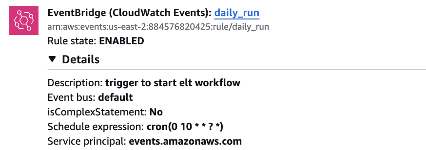  
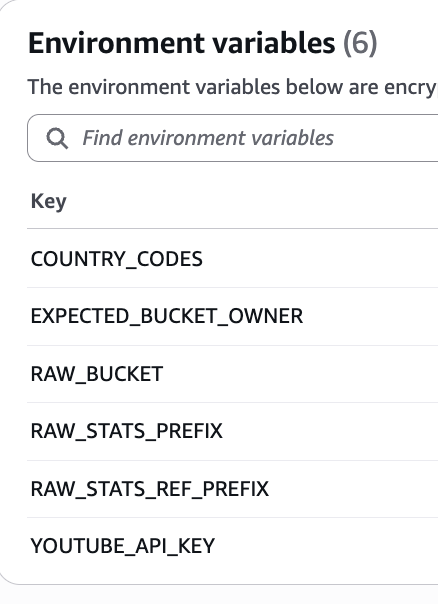  
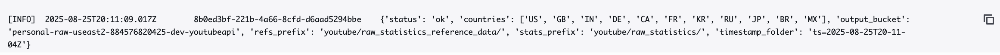  
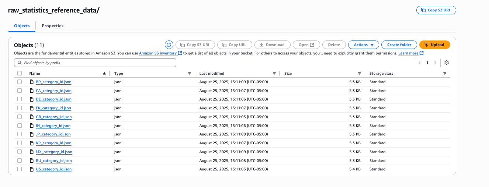  
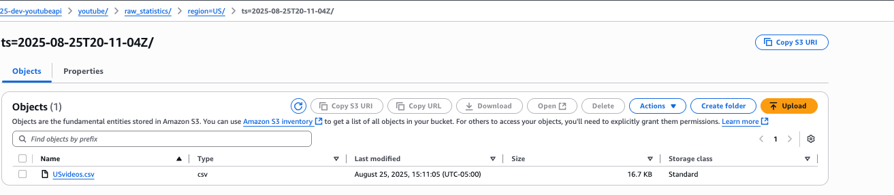

## Raw Orchestration
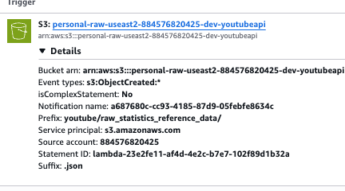  
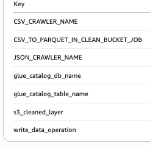  
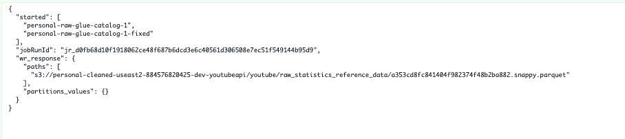  
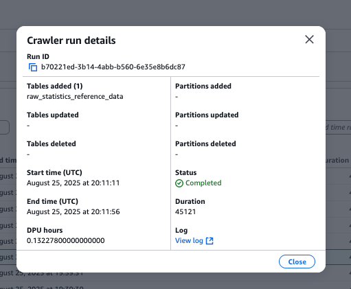

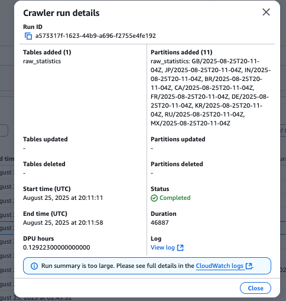

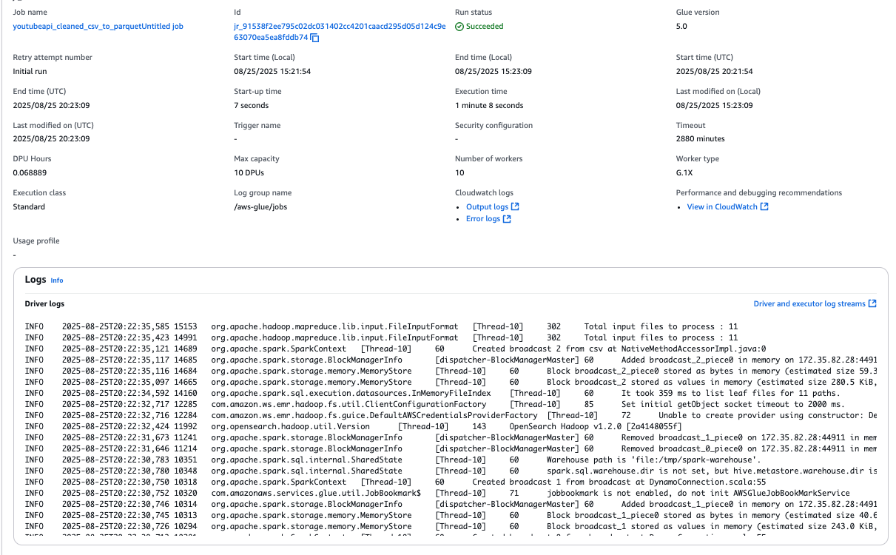

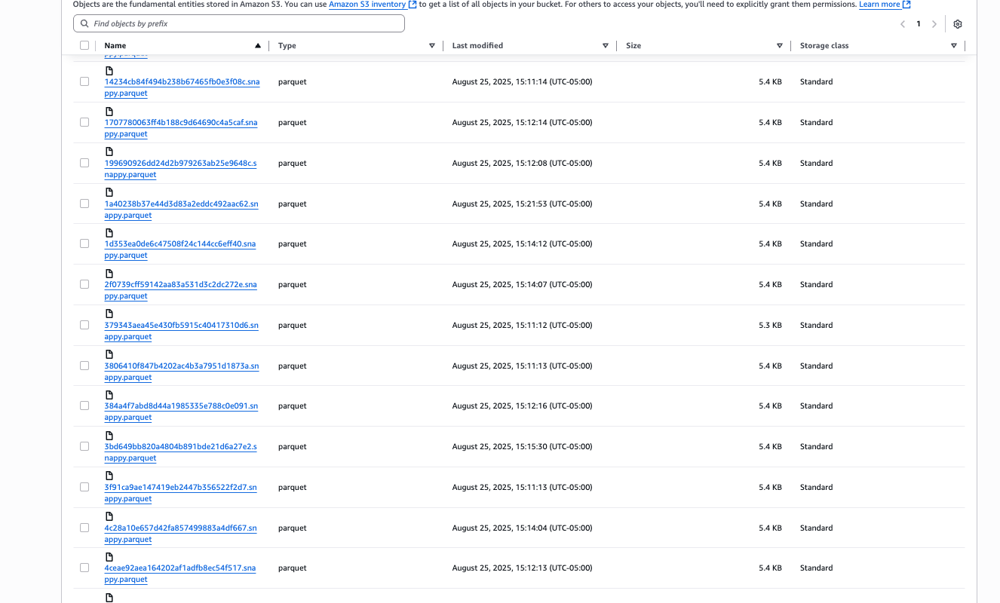 

## Cleaned Orchestration
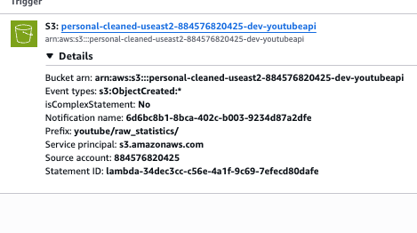  
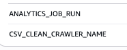  
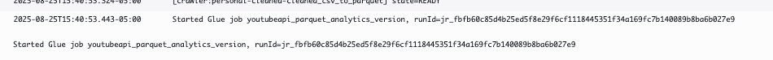  
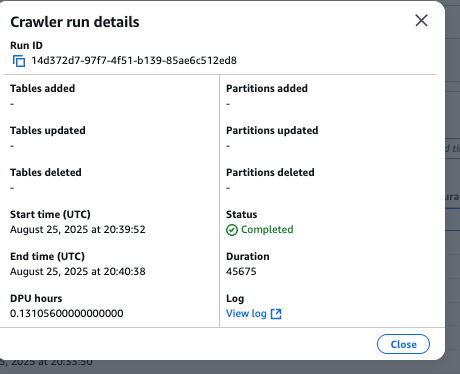

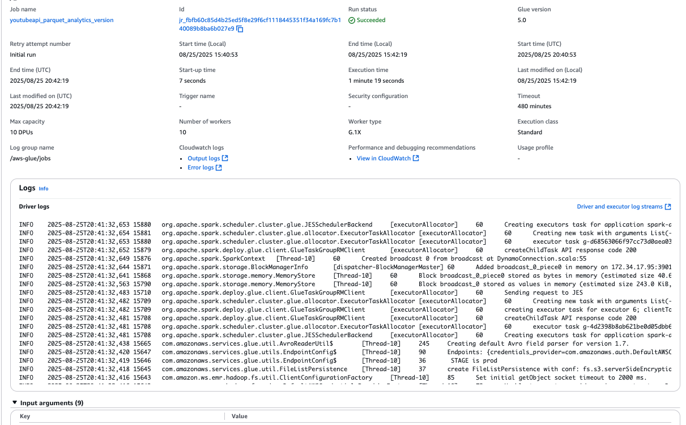

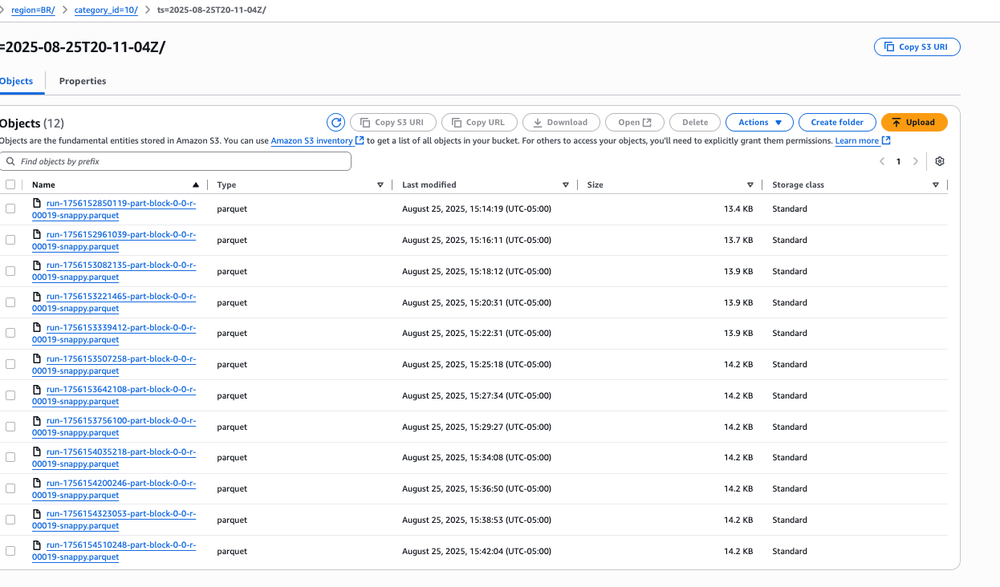

## Analytics
- Athena sample query & results: see `docs/ANALYTICS.md`

---

## IAM (roles used)

> IAM = Identity & Access Management. Below are the roles this pipeline uses.

- **Lambda Execution Role — `youtube_api_fetch_raw`**
  - Permissions: `s3:PutObject` to Bronze prefixes; `logs:CreateLogGroup/Stream`, `logs:PutLogEvents`.
  - CloudWatch Logs permissions.

- **Lambda Execution Role — `raw_json_parquet_orchestrator`**
  - Permissions: `glue:StartCrawler`, `glue:StartJobRun`, `glue:GetCrawler`, `glue:GetJobRun`,`s3:GetObject`, `s3:PutObject`.
  - CloudWatch Logs permissions.
  

- **Lambda Execution Role — `cleaned_parquet_orchestrator`**
  - Permissions: `glue:StartCrawler`, `glue:StartJobRun`, `glue:Get*`, `s3:GetObject`, `s3:PutObject`.
  - CloudWatch Logs permissions.
  
- **Glue Job Role — `csv_to_parquet`**
  - Permissions: Read from **Bronze** CSV prefixes; write to **Silver** Parquet prefixes.
  - Glue, S3, CloudWatch Logs

- **Glue Job Role — `analytics_join`**
  - Permissions: Read from **Silver** tables/prefixes; write to **Gold**.
  - Glue, S3, Logs; 
  
- **Crawlers**
  - share a **Glue service role** with `s3:ListBucket`, `s3:GetObject` on the scanned prefixes and `glue:*` read/write on the Catalog DB/tables.

- **EventBridge Rule**
  - uses auto-generated role

---

## Optional Extra Screenshots (you can add these)
  
- `glue_crawler_cleaned_run.png` — Cleaned Parquet crawler run page.  
- `glue_job_analytics_join_run.png` — Analytics join job run page.  
